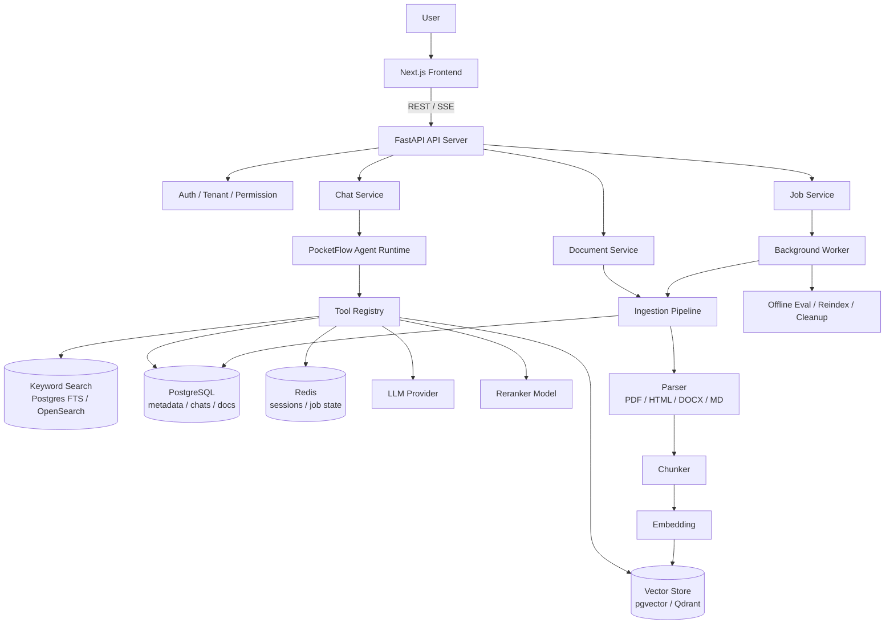
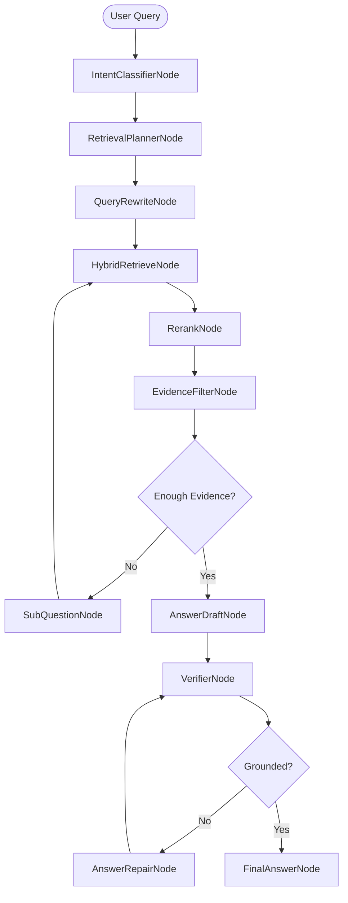
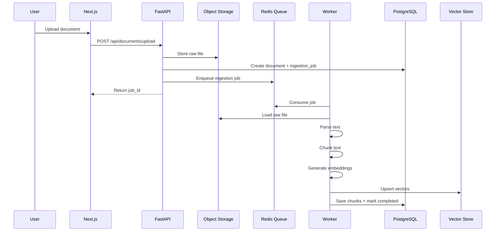
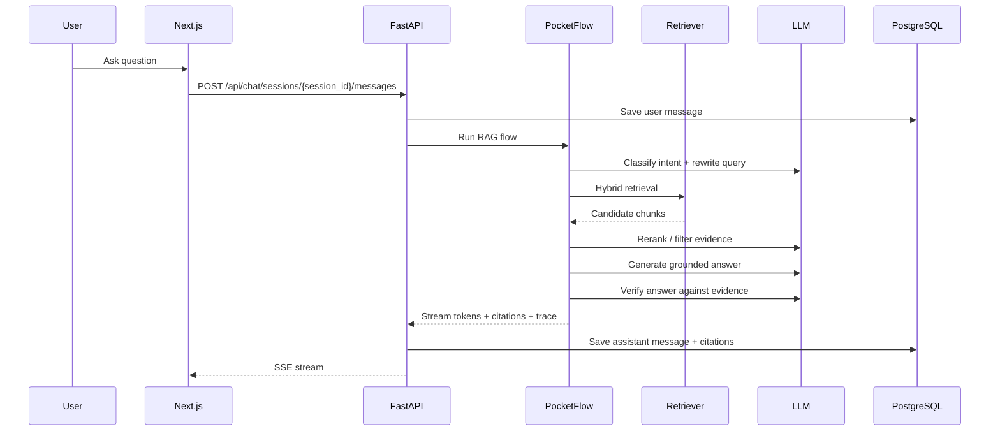
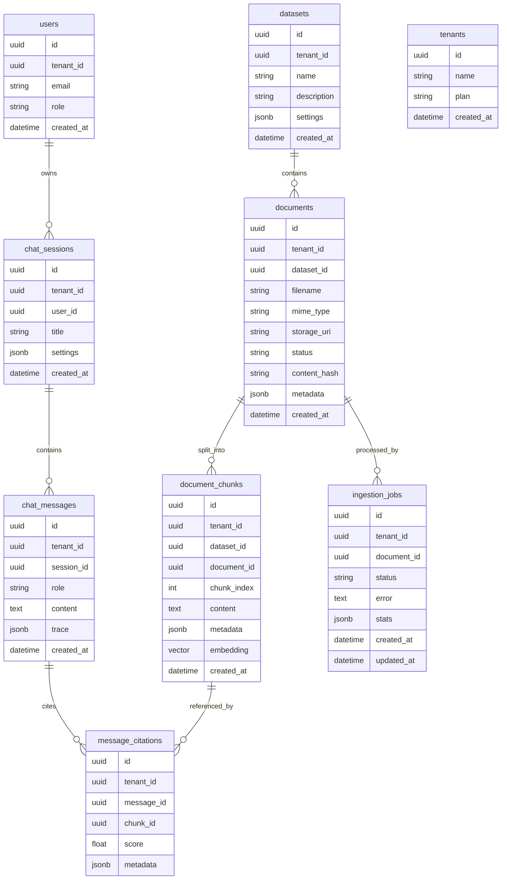
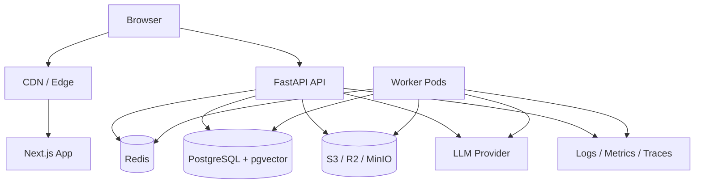

# FlowRAG

FlowRAG 是一个基于 [PocketFlow](https://github.com/The-Pocket/PocketFlow) 的 Agentic RAG 项目设计方案。前端使用 Next.js，后端使用 FastAPI，PocketFlow 负责编排多步骤检索、推理、验证和回答生成流程。

目标不是只做一个 `query -> retrieve -> generate` 的普通 RAG Demo，而是构建一个可演进的知识库问答系统：支持文档上传、异步入库、混合检索、Agent 规划、多跳检索、引用溯源、答案验证、可观测性和后续评测优化。

> 说明：本文档是架构设计与实施蓝图。PocketFlow 的具体 API 需要以其仓库当前版本为准，本文主要定义系统边界、模块职责和工作流形态。

## 目录

- [产品目标](#产品目标)
- [非目标](#非目标)
- [技术栈](#技术栈)
- [本地运行](#本地运行)
- [总体架构](#总体架构)
- [核心设计原则](#核心设计原则)
- [Agentic RAG 符合性评估](#agentic-rag-符合性评估)
- [Agentic RAG 设计](#agentic-rag-设计)
- [后端架构](#后端架构)
- [前端架构](#前端架构)
- [文档入库流程](#文档入库流程)
- [问答流程](#问答流程)
- [检索与重排策略](#检索与重排策略)
- [数据模型](#数据模型)
- [API 设计](#api-设计)
- [权限与多租户](#权限与多租户)
- [可观测性](#可观测性)
- [评测体系](#评测体系)
- [部署架构](#部署架构)
- [推荐目录结构](#推荐目录结构)
- [MVP 路线图](#mvp-路线图)
- [关键风险](#关键风险)

## 产品目标

FlowRAG 的核心目标：

1. 让用户可以上传文档，构建一个或多个知识库。
2. 用户在聊天界面中选择知识库并提问。
3. 系统通过 Agentic RAG 自动规划检索策略，而不是单次向量检索。
4. 回答必须基于证据，并返回 citation。
5. 支持复杂问题的 query rewrite、问题拆解、多轮检索和答案验证。
6. 为调试和迭代提供完整 trace，包括检索结果、重排结果、LLM 输入输出、耗时和 token 用量。
7. 后续可以演进为企业知识库、内部文档助手、客服知识助手或研究资料问答系统。

## 非目标

MVP 阶段不优先做以下能力：

1. 复杂工作流编辑器。
2. 多 Agent 协作可视化画布。
3. 私有大模型训练平台。
4. 全量企业权限系统，例如对接复杂 IAM、LDAP、ABAC。
5. 极大规模向量检索优化。

这些能力可以在核心 RAG 链路稳定后再扩展。

## 技术栈

| 层 | 技术选择 | 说明 |
|---|---|---|
| 前端 | Next.js App Router | Web UI、聊天、文档管理、调试面板 |
| UI 状态 | React Query / SWR | 请求缓存、状态同步 |
| 后端 API | FastAPI | 鉴权、业务 API、SSE 流式输出 |
| Agent 编排 | PocketFlow | RAG 工作流节点编排 |
| 数据库 | PostgreSQL | 用户、文档、会话、审计、任务元数据 |
| 向量检索 | pgvector | MVP 首选，减少基础设施复杂度 |
| 关键词检索 | PostgreSQL FTS | 与 pgvector 配合做 hybrid retrieval |
| 缓存 | Redis | 会话状态、限流、任务状态、短期缓存 |
| 后台任务 | Celery / RQ / arq | 文档解析、embedding、重建索引 |
| 文件存储 | S3 / R2 / MinIO | 存储原始文件和解析产物 |
| LLM | OpenAI-compatible provider | 回答生成、query rewrite、验证 |
| Embedding | OpenAI-compatible embedding 或本地模型 | 文档向量化和 query 向量化 |
| Reranker | API reranker 或本地 cross-encoder | 对候选 chunk 重排 |
| 可观测性 | OpenTelemetry + structured logs | trace、metrics、logs |

MVP 建议使用 `PostgreSQL + pgvector + PostgreSQL FTS`。等数据量、召回质量或性能成为瓶颈，再单独引入 Qdrant、Milvus、OpenSearch 或 Elasticsearch。

## 本地运行

当前仓库提供一个不依赖外部 LLM、数据库或对象存储的本地 MVP，用于验证产品和 Agentic RAG 链路。

后端：

```bash
cd apps/api
uv --cache-dir .uv-cache sync
uv --cache-dir .uv-cache run uvicorn app.main:app --reload --port 8000
```

前端：

```bash
cd apps/web
pnpm install
pnpm dev --hostname 127.0.0.1 --port 3000
```

也可以在仓库根目录运行：

```bash
pnpm dev:web --hostname 127.0.0.1 --port 3000
```

验证后端核心链路：

```bash
cd apps/api
uv --cache-dir .uv-cache run --no-sync python -m unittest discover -s tests
# or
pnpm test:api
```

默认前端 API 地址是 `http://localhost:8000/api`，可以通过 `NEXT_PUBLIC_API_BASE_URL` 覆盖。

Python 依赖统一由 `uv` 管理。新增或调整后端依赖后，在 `apps/api` 下运行 `uv --cache-dir .uv-cache lock` 并提交生成的 `uv.lock`。

## 总体架构



系统分为四个主要运行单元：

1. `nextjs-web`：前端应用，负责用户交互。
2. `fastapi-api`：后端 API，负责鉴权、业务逻辑、SSE 流式输出。
3. `worker`：后台任务，负责文档解析、embedding、索引构建、离线评测。
4. `postgres/redis/object-storage`：基础数据层。

PocketFlow 不直接暴露给前端。它作为 FastAPI 后端内部的 Agent runtime，被 `ChatService` 调用。

## 核心设计原则

1. 前端不直接访问 LLM、向量库或 PocketFlow。
2. FastAPI 是唯一业务入口，统一处理鉴权、租户隔离、权限、审计和限流。
3. PocketFlow 只负责编排 Agentic RAG 流程，不承担 HTTP、数据库模型和权限逻辑。
4. 文档入库和问答解耦：上传后异步解析和建索引，避免阻塞用户请求。
5. 每次回答必须保留证据链，最终回答需要 citation。
6. 所有检索都必须带权限过滤条件，不能只依赖前端过滤。
7. 每次问答都要有 trace，方便复盘检索质量、重排质量和答案质量。
8. 先做可用的 MVP，再通过评测集驱动优化。

## Agentic RAG 符合性评估

当前仓库已经包含一个本地内存 MVP：FastAPI 后端、Next.js 前端、Agentic RAG flow、文档上传、同步入库、哈希 embedding、hybrid retrieval、rerank、citation、trace 和基础测试。它可以验证端到端产品闭环，但还不是生产级 Agentic RAG：PostgreSQL/pgvector、Redis worker、对象存储、真实 LLM/embedding provider、PocketFlow runtime 适配和离线评测集仍待接入。

设计目标整体符合 Agentic RAG 的方向。要在生产实现层面真正达标，需要继续把 agent 的决策边界、工具契约、循环退出条件、验证标准和评测阈值落到持久化基础设施、自动化测试和评测报告中。

### 符合项

| Agentic RAG 能力 | README 当前覆盖情况 |
|---|---|
| 多步骤任务规划 | 已设计 intent classify、retrieval plan、query rewrite、decomposition |
| 工具调用 | 已规划 vector search、keyword search、document lookup、reranker、LLM、citation builder |
| 多轮检索 | 已设计 evidence 不足时进入 sub-question/retrieve 循环 |
| 证据约束回答 | 已要求 evidence filtering、citation、grounded answer |
| 自我验证与修复 | 已设计 verifier 和 answer repair |
| 可观测性 | 已要求 trace、latency、token、retrieval/rerank 结果记录 |
| 质量优化 | 已规划离线评测与回归测试 |

### 待补强项

1. **生产基础设施待接入**：当前 repository、embedding、LLM 和 ingestion queue 都是本地 MVP 实现，需要替换为 PostgreSQL/pgvector、Redis worker、对象存储和真实 provider。
2. **PocketFlow runtime 待适配**：当前 agent flow 按 PocketFlow 节点边界实现，但还没有绑定 PocketFlow 包的实际 API。
3. **Agent 循环控制需要落到测试**：已定义最大检索轮数、最大子问题数量和预算参数，但还需要覆盖复杂多跳场景。
4. **工具契约需要继续强化**：tool 已有结构化 `ToolResult`，后续要补 provider request id、重试、熔断和敏感信息脱敏。
5. **验证标准需要评测集证明**：verifier 已返回 structured result，但 citation precision、faithfulness、retrieval recall 仍需要离线 eval 验证。
6. **失败降级策略需要扩大覆盖**：已有证据不足降级测试，仍需覆盖 reranker 失败、LLM 超时、证据冲突和权限越权。

## Agentic RAG 设计

普通 RAG 流程：

```text
query -> retrieve -> generate
```

FlowRAG 采用 Agentic RAG：

```text
query
-> intent classify
-> query rewrite / decomposition
-> retrieval plan
-> hybrid retrieval
-> rerank
-> evidence filtering
-> answer draft
-> verification
-> final answer with citations
```

### PocketFlow 工作流



### Agent 决策与控制策略

Agentic RAG 不应把所有问题都强行走最重的多步流程。FlowRAG 建议采用分级策略：

| 场景 | 策略 |
|---|---|
| 闲聊、无知识库问题 | 不检索，直接回复或要求用户选择知识库 |
| 简单事实问题 | fast path：rewrite -> hybrid retrieval -> answer with citations |
| 总结、比较、跨文档问题 | agentic path：planner -> decomposition -> multi-hop retrieval -> verification |
| 证据不足问题 | 最多补充检索，仍不足则明确回答无法从当前知识库确认 |
| 越权或敏感请求 | 拒绝访问，并记录安全 trace |

建议的默认控制参数：

| 参数 | 默认值 | 目的 |
|---|---|---|
| `max_retrieval_rounds` | 3 | 限制补充检索循环 |
| `max_sub_questions` | 5 | 限制问题拆解规模 |
| `max_rewritten_queries` | 3 | 控制 query rewrite 成本 |
| `max_candidate_chunks` | 80 | 控制 rerank 输入规模 |
| `max_evidence_chunks` | 10 | 控制最终上下文长度 |
| `node_timeout_seconds` | 30 | 避免单个节点长时间阻塞 |
| `flow_token_budget` | 按租户/模型配置 | 控制单次问答成本 |

Evidence 不足时只允许在预算内继续检索。达到上限后，系统应输出“当前知识库证据不足”的回答，并返回已检查的数据源和 trace 摘要，而不是编造结论。

### 共享上下文

PocketFlow 中的共享上下文建议保持结构化，便于调试、持久化和回放：

```python
shared = {
    "tenant_id": "...",
    "user_id": "...",
    "conversation_id": "...",
    "message_id": "...",
    "query": "...",
    "intent": "...",
    "retrieval_plan": {},
    "rewritten_queries": [],
    "sub_questions": [],
    "retrieved_chunks": [],
    "reranked_chunks": [],
    "evidence": [],
    "draft_answer": "",
    "final_answer": "",
    "citations": [],
    "trace_id": "...",
}
```

### 节点职责

| Node | 职责 |
|---|---|
| `IntentClassifierNode` | 判断问题类型：普通问答、总结、比较、多跳推理、闲聊、越权请求 |
| `RetrievalPlannerNode` | 决定检索哪些 dataset、是否使用 metadata filter、top_k、是否需要多轮检索 |
| `QueryRewriteNode` | 将用户问题改写为更适合检索的 query |
| `SubQuestionNode` | 对复杂问题拆分成多个子问题 |
| `HybridRetrieveNode` | 执行 vector search + keyword search + metadata filter |
| `RerankNode` | 对候选 chunk 做重排 |
| `EvidenceFilterNode` | 去重、过滤低质量 chunk、选择可支撑回答的证据 |
| `AnswerDraftNode` | 基于证据生成初稿 |
| `VerifierNode` | 检查回答是否被证据支持，标记 unsupported claims |
| `AnswerRepairNode` | 删除幻觉内容，补齐引用，必要时触发补充检索 |
| `FinalAnswerNode` | 输出最终回答、citation、confidence 和 trace 摘要 |

### Tool Registry

Agent 节点不应直接访问底层实现，而应通过工具层调用：

```text
agent/tools/
  vector_search.py
  keyword_search.py
  metadata_filter.py
  document_lookup.py
  reranker.py
  llm.py
  citation_builder.py
```

这样后续可以替换 pgvector、OpenSearch、LLM provider 或 reranker，而不影响工作流主体。

每个 tool 都应暴露结构化契约：

```python
class ToolResult(TypedDict):
    ok: bool
    data: dict
    error_code: str | None
    error_message: str | None
    trace: dict
```

工具层必须统一处理：

1. `tenant_id`、`dataset_ids`、ACL filter 的强制注入。
2. 超时、重试、熔断和降级。
3. 输入输出摘要写入 trace，避免记录敏感全文。
4. 可回放的 request id、provider、latency、token/cost 信息。

### 验证与降级

Verifier 输出应是结构化结果，而不是只给自然语言评论：

```json
{
  "grounded": true,
  "groundedness_score": 0.91,
  "unsupported_claims": [],
  "missing_citations": [],
  "conflicting_evidence": [],
  "needs_retrieval": false
}
```

当 `grounded=false` 时，系统按以下顺序处理：

1. 删除或改写 unsupported claims。
2. 如果缺 citation 且仍有预算，触发补充检索。
3. 如果证据冲突，明确列出冲突来源，不给单一确定结论。
4. 如果证据不足，返回无法确认，并展示已使用的 citation 和 trace 摘要。

最终答案必须满足：

1. 所有事实性断言都有 evidence 支撑。
2. citation 指向具体 document/chunk/page/section。
3. 没有 citation 的推断必须明确标注为推断或不输出。
4. 用户无权限访问的 chunk 不得出现在答案、citation 或 trace 中。

## 后端架构

FastAPI 后端建议分层：

```text
HTTP routes -> service layer -> agent/runtime/tools -> repositories -> database/external services
```

### 后端模块

| 模块 | 职责 |
|---|---|
| `api` | HTTP routes、request/response schema、SSE endpoint |
| `core` | 配置、日志、安全、错误处理、依赖注入 |
| `db` | SQLAlchemy/SQLModel models、session、migration |
| `services` | 业务服务：聊天、文档、检索、embedding、LLM |
| `agent` | PocketFlow flows、nodes、tools |
| `workers` | 异步任务、文档入库、重建索引、离线评测 |

### 服务边界

| Service | 说明 |
|---|---|
| `ChatService` | 创建会话、保存消息、调用 PocketFlow、返回 SSE stream |
| `DocumentService` | 上传、删除、查询文档，管理文档状态 |
| `IngestionService` | 解析、chunk、embedding、写入索引 |
| `RetrievalService` | 混合检索、权限过滤、去重 |
| `EmbeddingService` | 文档和 query 的 embedding |
| `LLMService` | LLM 调用封装、重试、超时、token 统计 |
| `RerankService` | 候选 chunk 重排 |
| `CitationService` | citation 构建、来源上下文查询 |

## 前端架构

前端使用 Next.js App Router。核心界面不是营销落地页，而是直接进入可使用的知识库和聊天体验。

当前 UI 层采用项目内 shadcn/ui 风格的 Base UI primitives，位于 `apps/web/components/ui`，由 Tailwind CSS tokens 驱动。前端依赖和脚本统一使用 `pnpm`。

### 页面结构

```text
app/
  login/
  datasets/
    page.tsx
    [datasetId]/
      page.tsx
  documents/
    page.tsx
  chat/
    page.tsx
    [sessionId]/
      page.tsx
  settings/
```

### 关键组件

| 组件 | 功能 |
|---|---|
| `ChatShell` | 聊天页整体布局 |
| `ChatComposer` | 输入问题、选择知识库、提交消息 |
| `StreamingAnswer` | 渲染 SSE token stream |
| `CitationList` | 展示引用来源 |
| `SourcePreview` | 查看 chunk 上下文、页码、文件名 |
| `DatasetSelector` | 选择一个或多个知识库 |
| `DocumentUploader` | 上传文档并显示入库状态 |
| `DocumentTable` | 文档列表、状态、错误信息、删除操作 |
| `TracePanel` | 开发环境显示 Agent 步骤、耗时、检索结果 |
| `JobStatusBadge` | 展示 ingestion/reindex job 状态 |

### 前端状态

1. 服务端数据：使用 React Query 或 SWR。
2. 聊天流式输出：使用 SSE 或 fetch streaming。
3. 本地 UI 状态：使用 React state 或 Zustand。
4. 当前 dataset/session：保存在 URL 和服务端 session 中，避免只依赖 localStorage。

## 文档入库流程



### Parser 策略

| 类型 | 处理方式 |
|---|---|
| Markdown | 按标题层级解析，保留 heading path |
| HTML | 提取正文，保留标题、链接和层级 |
| PDF | 提取页码、段落、表格，保留 page number |
| DOCX | 按标题、段落、表格解析 |
| TXT | 按段落和 token 窗口切分 |
| CSV/XLSX | 表格行列结构转为可检索文本，保留 sheet/row/column metadata |

### Chunking 策略

| 参数 | 建议值 |
|---|---|
| 默认 chunk size | 500-900 tokens |
| overlap | 80-150 tokens |
| top-level split | 标题、章节、页码、段落 |
| table chunk | 独立 chunk，保留表头和上下文 |
| code chunk | 按函数、类或文件结构切分 |

每个 chunk 至少保存：

```json
{
  "tenant_id": "tenant_xxx",
  "dataset_id": "dataset_xxx",
  "document_id": "doc_xxx",
  "filename": "policy.pdf",
  "mime_type": "application/pdf",
  "page": 12,
  "section": "Refund Policy",
  "chunk_index": 33,
  "content_hash": "sha256:..."
}
```

## 问答流程



### SSE 事件格式

```text
event: token
data: {"text":"..."}

event: citation
data: {"document_id":"...","chunk_id":"...","score":0.87}

event: trace
data: {"node":"HybridRetrieveNode","latency_ms":95}

event: done
data: {"message_id":"..."}

event: error
data: {"code":"LLM_TIMEOUT","message":"..."}
```

## 检索与重排策略

MVP 使用 hybrid retrieval：

1. Query rewrite：生成 1-3 个检索 query。
2. Vector search：语义召回。
3. Keyword search：关键词召回。
4. Metadata filter：强制 tenant、dataset、ACL、文件类型、时间范围过滤。
5. Merge：合并候选、去重。
6. Rerank：对 top 30-80 候选重排。
7. Evidence filter：选择最能支撑回答的 top 4-10 个 chunk。

### 融合打分

初始版本可以使用线性融合：

```text
final_score = 0.55 * vector_score + 0.25 * keyword_score + 0.20 * rerank_score
```

后续可以根据问题类型动态调整权重：

| 问题类型 | 策略 |
|---|---|
| 精确术语 / 编号 / ID | 提高 keyword 权重 |
| 概念解释 | 提高 vector 权重 |
| 对比问题 | 增加 sub-question decomposition |
| 总结问题 | 扩大 top_k 并按章节聚合 |
| 时间范围问题 | 强制 metadata date filter |

## 数据模型



### 状态枚举

文档状态：

```text
uploaded -> parsing -> chunking -> embedding -> indexed -> failed
```

任务状态：

```text
queued -> running -> succeeded -> failed -> cancelled
```

消息角色：

```text
user | assistant | system | tool
```

## API 设计

### Documents

```http
POST   /api/documents/upload
GET    /api/documents
GET    /api/documents/{document_id}
DELETE /api/documents/{document_id}
POST   /api/documents/{document_id}/reindex
```

上传响应：

```json
{
  "document_id": "doc_xxx",
  "job_id": "job_xxx",
  "status": "queued"
}
```

### Datasets

```http
POST   /api/datasets
GET    /api/datasets
GET    /api/datasets/{dataset_id}
PATCH  /api/datasets/{dataset_id}
DELETE /api/datasets/{dataset_id}
POST   /api/datasets/{dataset_id}/reindex
```

### Chat

```http
POST /api/chat/sessions
GET  /api/chat/sessions
GET  /api/chat/sessions/{session_id}
POST /api/chat/sessions/{session_id}/messages
GET  /api/chat/sessions/{session_id}/stream?message_id=xxx
```

创建消息请求：

```json
{
  "content": "总结这份合同的付款条款和违约责任",
  "dataset_ids": ["dataset_xxx"],
  "options": {
    "stream": true,
    "show_trace": false,
    "top_k": 40
  }
}
```

创建消息响应：

```json
{
  "message_id": "msg_xxx",
  "assistant_message_id": "msg_yyy",
  "stream_url": "/api/chat/sessions/session_xxx/stream?message_id=msg_yyy"
}
```

### Jobs

```http
GET /api/jobs/{job_id}
GET /api/jobs?status=running
```

任务响应：

```json
{
  "job_id": "job_xxx",
  "status": "running",
  "progress": 0.45,
  "stage": "embedding",
  "error": null
}
```

### Health

```http
GET /api/health
GET /api/health/ready
GET /api/health/live
```

## 权限与多租户

所有业务表都建议包含 `tenant_id`。所有检索、文档查询、会话查询都必须强制加上租户和权限条件。

### 权限过滤原则

1. 前端过滤只用于体验，不能作为安全边界。
2. FastAPI dependency 中解析 user 和 tenant。
3. Repository 层默认接收 `tenant_id`。
4. Vector search 必须带 `tenant_id`、`dataset_id allowlist`、document ACL filter。
5. Citation 查询也必须二次校验权限，避免通过 chunk_id 越权读内容。

### 基础角色

| 角色 | 权限 |
|---|---|
| `owner` | 管理租户、用户、全部知识库 |
| `admin` | 管理知识库和文档 |
| `member` | 使用被授权的知识库问答 |
| `viewer` | 只读问答和查看引用 |

## 可观测性

每次请求生成 `trace_id`，并贯穿前端、FastAPI、PocketFlow、LLM 调用、检索调用和数据库写入。

### Trace 结构

```json
{
  "trace_id": "trace_xxx",
  "tenant_id": "tenant_xxx",
  "session_id": "session_xxx",
  "message_id": "msg_xxx",
  "latency_ms": 2340,
  "llm_tokens_prompt": 3200,
  "llm_tokens_completion": 480,
  "retrieval_top_k": 40,
  "rerank_top_k": 8,
  "selected_chunks": ["chunk_1", "chunk_2"],
  "flow_steps": [
    {"node": "QueryRewriteNode", "latency_ms": 210, "status": "ok"},
    {"node": "HybridRetrieveNode", "latency_ms": 95, "status": "ok"},
    {"node": "AnswerDraftNode", "latency_ms": 1500, "status": "ok"}
  ]
}
```

### 关键指标

| 指标 | 说明 |
|---|---|
| `chat_latency_ms` | 端到端问答耗时 |
| `first_token_latency_ms` | 首 token 延迟 |
| `retrieval_latency_ms` | 检索耗时 |
| `rerank_latency_ms` | 重排耗时 |
| `llm_latency_ms` | LLM 耗时 |
| `citation_count` | citation 数量 |
| `unsupported_claim_count` | 验证阶段发现的无证据断言数量 |
| `ingestion_success_rate` | 文档入库成功率 |
| `embedding_cost` | embedding 成本 |
| `llm_cost` | LLM 成本 |

## 评测体系

Agentic RAG 不能只靠人工感觉调参。建议从 MVP 开始维护评测集。

### 评测数据

每个 dataset 至少准备 30-100 个问题：

```json
{
  "question": "合同中的付款周期是多少？",
  "expected_answer": "...",
  "expected_sources": ["doc_xxx:page_12"],
  "tags": ["fact", "contract", "single-hop"]
}
```

### 评测维度

| 维度 | 说明 |
|---|---|
| Answer Correctness | 答案是否正确 |
| Citation Precision | 引用是否真的支撑答案 |
| Citation Recall | 是否找到了应该引用的来源 |
| Faithfulness | 回答是否忠于证据 |
| Retrieval Recall@K | top K 是否包含正确 chunk |
| Latency | 响应速度 |
| Cost | token 与 API 成本 |

### Agentic RAG 验收门槛

MVP 阶段建议用以下门槛判断是否真正达到 Agentic RAG，而不是停留在普通 RAG：

| 验收项 | 最低要求 |
|---|---|
| Trace 完整度 | 每次回答记录 intent、plan、rewrite、retrieve、rerank、evidence、verify、final 节点状态 |
| Citation precision | 评测集 citation precision >= 0.85 |
| Faithfulness | 评测集 faithfulness >= 0.90 |
| Retrieval recall | 单跳问题 Recall@10 >= 0.85，多跳问题 Recall@20 >= 0.75 |
| 多跳触发 | 标注为 comparison/multi-hop 的问题必须触发 decomposition 或 multi-query retrieval |
| 证据不足处理 | 无答案问题不得编造，应返回证据不足，unsupported claim count = 0 |
| 权限过滤 | 越权数据在 retrieval、citation、trace 中均不可见，测试覆盖率 100% |
| 循环控制 | 所有 agentic flow 必须遵守 max rounds、timeout、token budget |
| 延迟预算 | P95 首 token 延迟和端到端耗时按模型与部署环境设阈值，并进入回归报告 |

只有当这些指标能在固定评测集和自动化测试中稳定通过时，Phase 4 才算完成。

### 回归测试

每次调整 chunking、embedding、rerank、prompt 或 PocketFlow 节点逻辑后，跑离线 eval，避免局部优化破坏整体效果。

## 部署架构



生产环境最小组件：

```text
flowrag-web
flowrag-api
flowrag-worker
postgres
redis
object-storage
```

### 环境变量

```env
DATABASE_URL=postgresql+psycopg://...
REDIS_URL=redis://...
OBJECT_STORAGE_ENDPOINT=...
OBJECT_STORAGE_BUCKET=flowrag
OBJECT_STORAGE_ACCESS_KEY=...
OBJECT_STORAGE_SECRET_KEY=...
LLM_BASE_URL=...
LLM_API_KEY=...
LLM_MODEL=...
EMBEDDING_MODEL=...
RERANKER_MODEL=...
JWT_SECRET=...
APP_ENV=development
```

## 推荐目录结构

```text
FlowRAG/
  README.md
  apps/
    web/
      app/
      components/
      lib/
      hooks/
      package.json
    api/
      app/
        main.py
        api/
          routes_chat.py
          routes_documents.py
          routes_datasets.py
          routes_jobs.py
          routes_health.py
        core/
          config.py
          security.py
          logging.py
          errors.py
        db/
          session.py
          models.py
          repositories.py
          migrations/
        services/
          chat_service.py
          document_service.py
          ingestion_service.py
          retrieval_service.py
          embedding_service.py
          llm_service.py
          rerank_service.py
          citation_service.py
        agent/
          flows/
            rag_flow.py
            ingestion_flow.py
          nodes/
            intent.py
            planner.py
            rewrite.py
            retrieve.py
            rerank.py
            verify.py
            answer.py
          tools/
            vector_search.py
            keyword_search.py
            metadata_filter.py
            document_lookup.py
        workers/
          worker_app.py
          tasks.py
      pyproject.toml
  packages/
    shared-contracts/
  infra/
    docker-compose.yml
    Dockerfile.api
    Dockerfile.web
    Dockerfile.worker
  docs/
    architecture.md
    api.md
    eval.md
```

## MVP 路线图

### Phase 1: 基础骨架

1. 初始化 monorepo。
2. 创建 Next.js 前端和 FastAPI 后端。
3. 接入 PostgreSQL、Redis、对象存储。
4. 实现用户、dataset、document、chat 基础模型。
5. 实现健康检查和基础日志。

### Phase 2: 文档入库

1. 文档上传 API。
2. 后台 ingestion job。
3. 文档解析、chunking、embedding。
4. pgvector 写入。
5. 前端文档列表和入库状态展示。

### Phase 3: 简单 RAG

1. 用户提问。
2. query embedding。
3. vector search。
4. LLM 基于 top chunks 生成回答。
5. 返回 citation。
6. 前端 SSE 流式渲染。

### Phase 4: PocketFlow Agentic RAG

1. 接入 PocketFlow runtime。
2. 实现 intent、rewrite、retrieve、rerank、answer、verify 节点。
3. 增加 hybrid retrieval。
4. 增加答案验证和修复。
5. 保存完整 trace。

### Phase 5: 质量优化

1. 建立评测集。
2. 评估 retrieval recall、citation precision、faithfulness。
3. 调整 chunking 和 rerank。
4. 优化 prompt 和节点流程。
5. 增加 TracePanel 辅助调试。

### Phase 6: 生产化

1. 多租户和权限控制。
2. 限流和成本控制。
3. 审计日志。
4. OpenTelemetry。
5. CI/CD。
6. 数据备份和恢复。

## 关键风险

| 风险 | 表现 | 对策 |
|---|---|---|
| 文档解析质量差 | PDF 表格丢失、段落错乱 | 保留原文位置，针对 PDF/表格单独优化 parser |
| Chunking 不合理 | 检索结果缺上下文或太长 | 按文档结构切分，保存 heading path 和 page metadata |
| 召回不足 | 正确答案不在 top K | hybrid retrieval、query rewrite、多 query 检索 |
| 引用不准确 | citation 不能支撑回答 | evidence filter + verifier + citation precision eval |
| Agent 流程过慢 | 多次 LLM 调用导致延迟高 | 分级策略，简单问题走 fast path，复杂问题走 agentic path |
| 成本不可控 | token 和 reranker 调用过多 | 限制 top_k、缓存 embedding、记录 cost、按租户限额 |
| 权限泄漏 | 用户检索到未授权文档 | 所有检索层强制 tenant_id 和 ACL filter |
| 调试困难 | 不知道错在检索还是生成 | 全链路 trace，保存节点输入输出摘要 |

## 初始实现建议

最务实的第一版不要一次性堆满所有 Agent 能力。建议先实现：

```text
文档上传 -> 异步入库 -> pgvector 检索 -> 带引用回答 -> SSE 前端展示
```

确认端到端闭环后，再逐步加入 PocketFlow 节点：

```text
query rewrite -> hybrid retrieval -> rerank -> verification -> repair
```

这样可以避免在基础链路不稳定时过早引入复杂 Agent 编排，后续每一步优化也更容易通过评测数据验证。
